
# COMP2150  - Level Design Document
### Name: Joshua Lukas
### Student number: 47712651

## 1. Player Experience

### 1.1. Discovery

The level introduces each mechanic of the game in a safe and controlled environment, allowing players to learn these mechanics easily and at their own pace before continuing their progression through the level. This design also ensures that players can understand any potential game dynamics available to them concurrently and can assure themselves that any tests of their mechanical skill later in the level will not be unfairly placed or executed. The beginning part of the first section of the level, for example, introduces players to multiple mechanics in a very flexible environment. As seen in the below screenshot, a platform is placed above the spikes and the monster pit is covered by a pass-through platform. While both dangers are avoidable if the player uses these platforms, they may wish to experiment with features of these mechanics, such as observing the monsters’ attack methods. As the player could lose a sizeable amount of health during testing, they are able to use the health collectable on the platform above to fully restore it before continuing the level, ensuring they can allow themselves enough testing to enable their mechanical success in any future challenges.

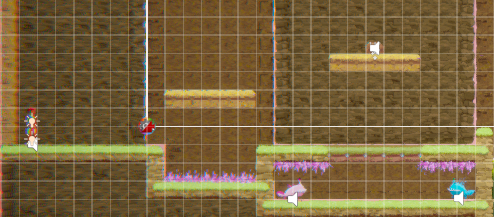

### 1.2. Drama

The intensity curve of the level allows it to maintain the player’s engagement through enemy layout and room geometry, by enabling periods of increased tension to appear in rooms that would otherwise cause an intensity drought, such as in the latter half of the second section and the former half of the third section, as depicted in the below screenshots. The key room in the second section illustrates this perfectly, as it is accessed from a similarly designed but very calm room, however this room is made intense through two Spitters attacking the player from an enclosed space, which can only be accessed through unpredictable moving platforms and makes any combat in this room close quarters. Furthermore, the beginning of the third section provides instant intensity despite being another open area, as the player is forced to initiate ranged combat with two Spitters with a newly acquired gun. Rising action is then employed as the player must descend towards the bottom of the level, initiating multiple fights in close quarters while doing so and ensuring their engagement.

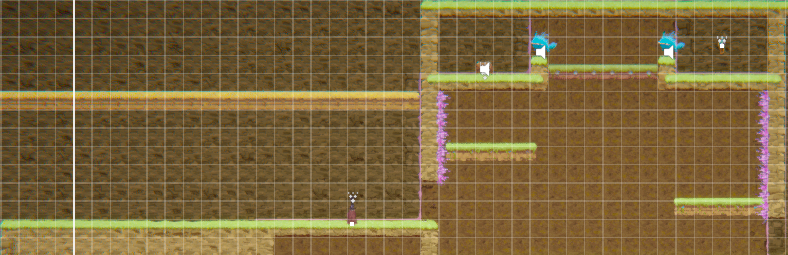

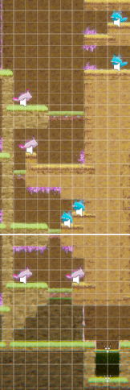

### 1.3. Challenge

The level successfully challenges the player through the application of difficulty which can only be overcome through the mastery of their physical and intellectual skill, allowing them to maintain a state of flow. As present in the screenshot, the latter half of the third section serves as the level’s final gauntlet, featuring attacks from Spitters on varying altitudes, preventing the player from speeding through the area. The player must always be aware of their position and must avoid additional projectiles while doing platforming or initiating regular combat. This requires an apt understanding of the game’s weapons, and the player must decide whether to attack, reposition, or do both, under any given circumstance. This continues when the player fights the Mega Spitter, and as retreating will likely disadvantage them, they must be wary of their health, time between their attacks, and the frequency of incoming attacks. Health collectibles and checkpoints near this area are scarce and weak, preventing the player from excluding difficulty from this final challenge and ensuring they must achieve a state of flow to complete the level.

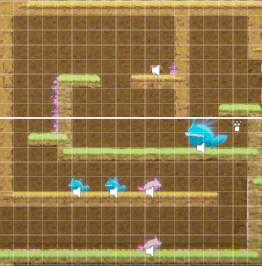

### 1.4. Exploration

The level encourages the player to explore using differing backgrounds and alternate routes, mostly present in the first two sections. As can be seen in the below screenshots, darker backgrounds are present behind any area without danger, while a lighter background is used whenever the player can lose health. When the player realizes this, it creates memorable areas when they return to past sections. To obtain the first key, the player must return to the first section after obtaining the staff to break a column, which they can do immediately or after finding a pass-through platform. While the first method is quicker, the second method allows the player to take advantage of the level’s exploration potential, giving them access to the powerful health collectible and a now winnable fight against the two monsters under it. These features of the level combined amplify the non-linear level design, making each area memorable and furthering player engagement.

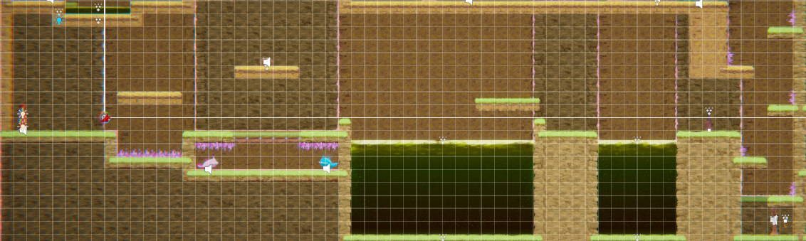

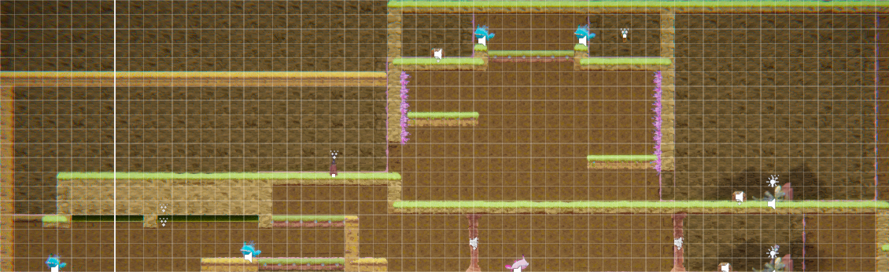

## 2. Core Gameplay

### 2.1. Spikes

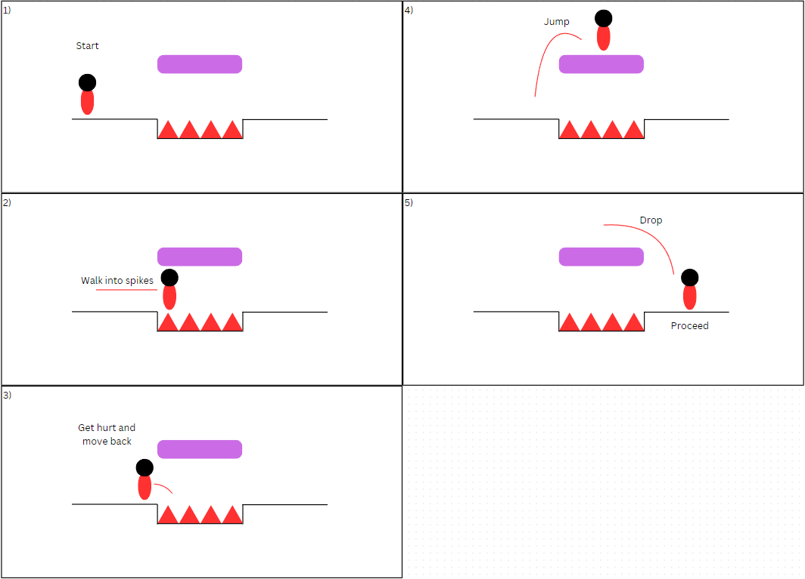

Spikes are introduced at the start of the level in a pit with a platform above them, allowing the player to ignore the spikes completely. These are introduced as the first mechanic in the level so the player can experiment with their knockback, as spikes are featured in platforming challenges in later areas.

### 2.2. Passthrough Platforms

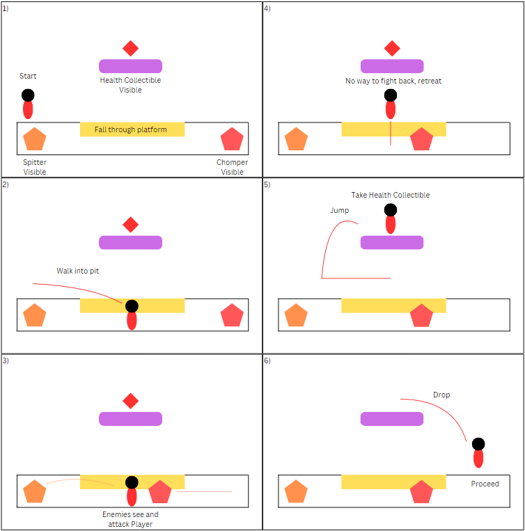

A passthrough platform is introduced at the start of the level acting as the entrance and exit for a monster pit, so the player doesn't accidentally enter the pit if they don't want to.

### 2.3. Spitters

A spitter is introduced in the monster pit so that the player can study its attacks without losing progress.

### 2.4. Chompers

A chomper is introduced in the monster pit so that the player can study its attacks without losing progress.

### 2.5. Health Pickups

A health pickup is introduced on a platform above the monster pit. This provides a full regeneration of health unlike future pickups, allowing players to experiment with the previous optional dangers safely.

### 2.6. Moving Platforms

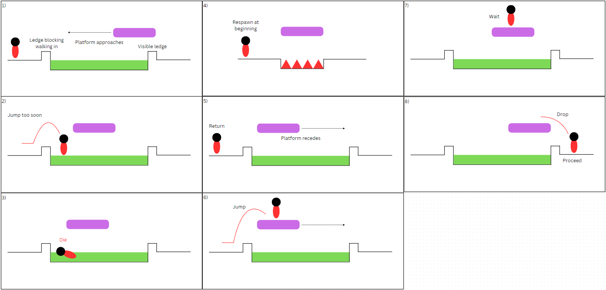

A moving platform is introduced above a pool of acid near the start of the level, and moves between two points whose positions ensure the player can simply drop off either side without having to time their jump on the platform.

### 2.7. Acid

Acid is introduced at the same area as the moving platform. If the player falls into the acid, they do not have to travel very far to get back, so its resetting dynamic should not affect the player's experience negatively.

### 2.8. Checkpoints

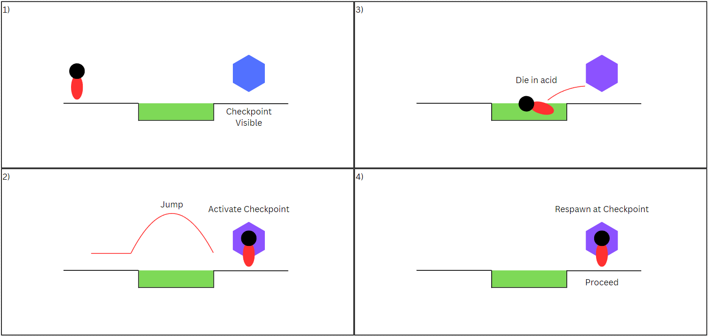

A checkpoint is present at the end of the two acid pool jumps, halfway through the first area. Being directly next to a pool of acid, players can easily experiment with the checkpoint system without having to repeat any platforming.

### 2.9. Weapon Pickup (Staff)

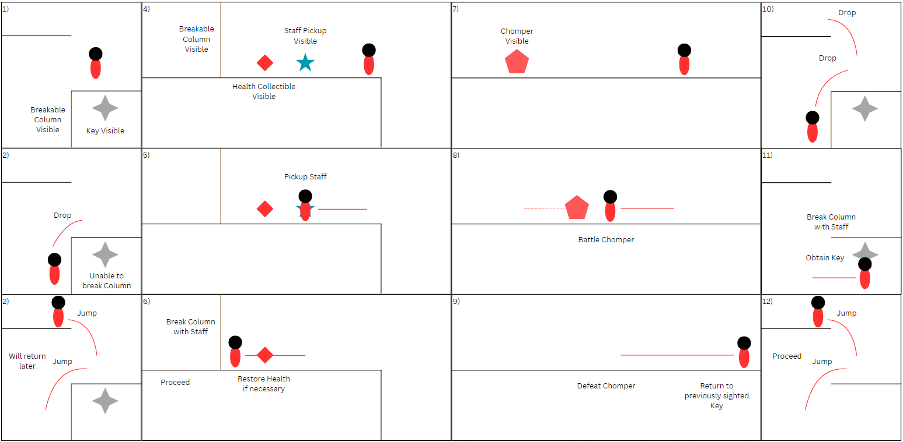

The staff pickup is introduced at the start of section two, next to a breakable column and a chomper. This allows the player to practice their weapon before they fight.

### 2.10. Keys

The first key is obtainable after the player picks up the staff, and is located behind a breakable column on a side path at the end of section one. The player can easily retrace their movements back to this area through multiple paths, helping the level feel non-linear.

### 2.11. Weapon Pickup (Gun)

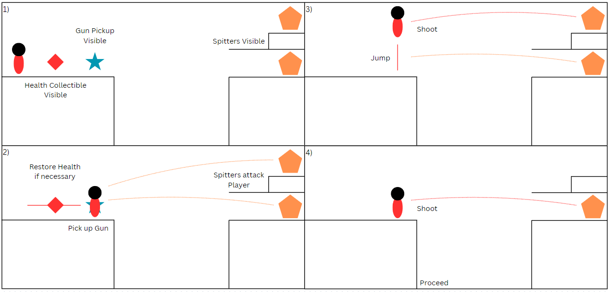

The gun pickup is introduced at the start of section three, across from an inaccessible platform with two spitters that attack the player. This allows the player to practice shooting enemies at different elevations and master this dynamic before the final gauntlet.

## 3. Spatiotemporal Design
 
### 3.1. Molecule Diagram

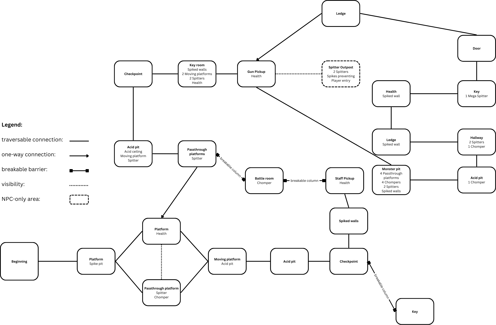

### 3.2. Level Map – Section 1

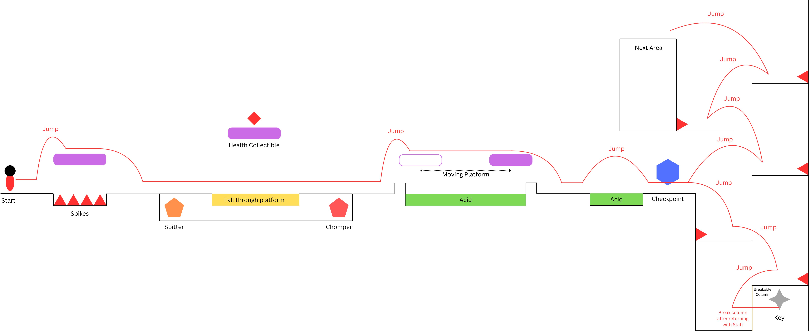

### 3.3. Level Map – Section 2

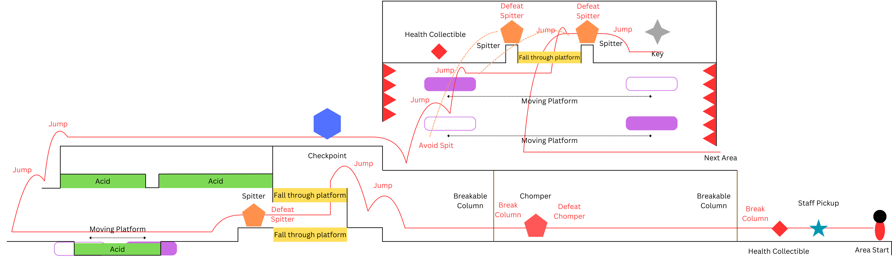

### 3.4. Level Map – Section 3

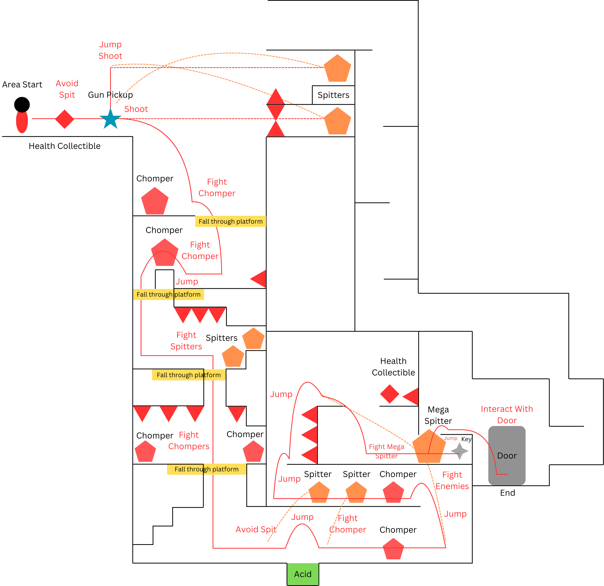

## 4. Iterative Design

Through iterative design and playtesting, the level was able to be restructured to provide the player with opportunities for exploration, and its difficulty curve was readjusted to feel fairer to the player. As can be seen in the grey-box screenshot below, some parts of the level do not allow the player much freedom when compared to their finalised versions. In the original prototype, the first key was freely accessible without needing the staff. While this is a very large problem for the level’s focus on exploration, later sections of the level did not provide any method of returning to this key’s location, so this prototype was impossible if section two had been completed past a certain point without the key, making the level fully linear. By implementing an extra passthrough platform, a breakable column blocking the first key and some layout changes in the second and third sections, the level was made more fun to explore and very non-linear. In the original prototype, the level was much more difficult, with a poorly placed second checkpoint further adding to the problem. This was fixed very early when finalising the level, but the introduction to acid was very complex, as jumping too late on the first moving platform would cause the player to fall after hitting the roof. The staff introduction was also unnecessarily complex, as there was no breakable column separating the player from the Chomper, meaning it could walk onto the edge of the next area’s entrance and block the player from picking up the staff. Furthermore, there were only two health pickups in the original level, both spaced far apart and only restoring one health each. The final section was also more difficult as each enemy had more health and the second last jump was nearly impossible. These issues were fixed when making the final layout, making the difficulty curve more forgiving to the player. In the final version of the level, there are two health pickups very close to each other between the second and third sections, while there are no health pickups between the beginning and end of the third section fights. This makes the third section very frustrating as the final health pickup is very difficult to reach. Using iterative design, the middle health pickup could be moved to a more convenient area to allow the player to have a higher chance at completing the level on their first try, and to make the final section more enjoyable.

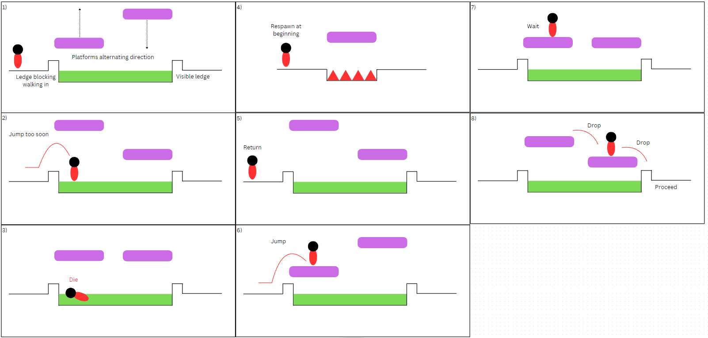

## Generative AI Use Acknowledgement

### Tool Used: None

**Nature of Use** N/A

**Evidence Attached?** N/A

**Additional Notes:** N/A